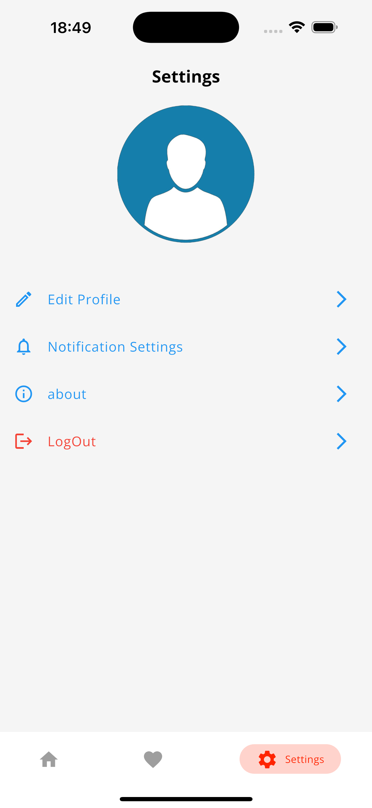
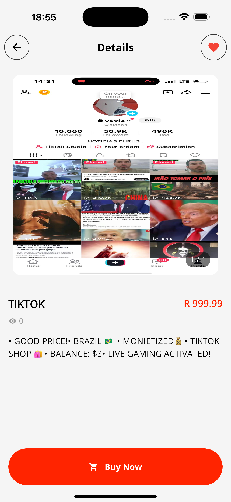
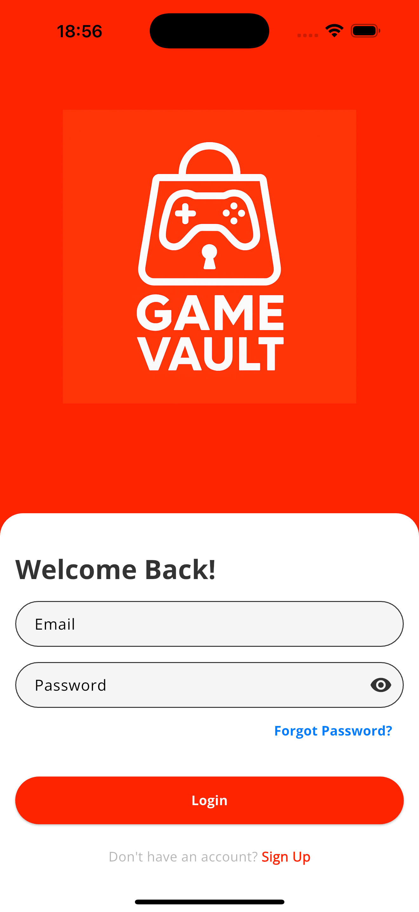
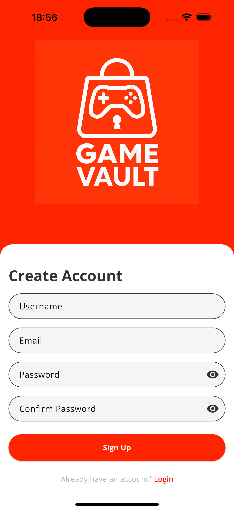
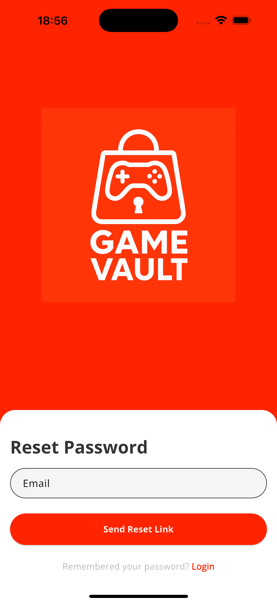

# Game Vault

Game Vault is a marketplace application designed for safely buying and selling gaming accounts, in-game items, and digital digital assets. The app provides a secure, user-friendly environment where users can browse listings, post their own offers, communicate with buyers and sellers, and report suspicious activity.

---

## Download

Click the button below to download the latest version of the app:

*Supports Android devices only.*

---

## Features

- View listings for game items and accounts
- Create and upload your own listings
- Secure built-in chat to communicate with buyers and sellers
- User reporting for suspicious or unsafe activity
- Simple and clean interface for easy navigation

---

## Screenshots

| Home | Listings | Details |
|------|---------|---------|
|  |  |  |

| Chat | Profile |
|------|---------|
|  |  |

---

## Safety, Terms & Privacy

We prioritize user safety and fair trading. Fraud, scamming, impersonation, or abusive behavior is not allowed and may result in account or listing removal.

- Terms & Policy: `termsAndPolicy/policy.txt`

Users are encouraged to report any suspicious listings directly in the app.

---

## Installation

1. Download the APK using the button above.
2. Open the file on your Android device.
3. If prompted, enable **Install from Unknown Sources**.
4. Launch Game Vault and create an account.

---

## Support

If you need assistance, feedback, or would like to report an issue:

- **Email:** retroff01@gmail.com
---

## Credits

Game Vault is independently developed and maintained.

Thank you for using the app.
